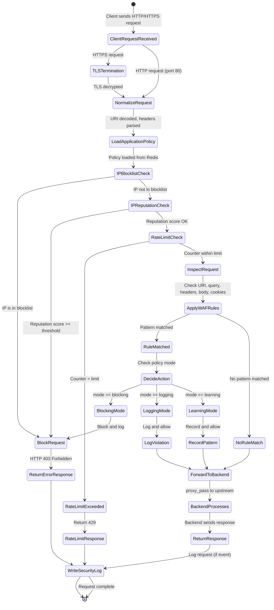

# B5 WAF — Request Lifecycle State Diagram

**Version:** 1.0  
**Last Updated:** 2026-05-03  
**Related:** [architecture_overview.md](architecture_overview.md), [waf_modes.md](waf_modes.md)

---

## 1. Overview

This document describes the complete lifecycle of an HTTP request as it passes through the B5 WAF system — from the moment a client connects to the point where a response is returned and the security event is logged.

Understanding the request lifecycle is important for:

- Knowing where and why a request is blocked.
- Debugging false positives (a legitimate request being blocked).
- Understanding the order in which checks run.
- Planning where to add new inspection logic.

---

## 2. Request Lifecycle State Diagram (Mermaid)



---

## 3. Step-by-Step Explanation

### Step 1: Client Request Received

The client (browser, mobile app, API consumer, attacker) sends an HTTP or HTTPS request to B5's public address on port 80 or 443.

**What happens in Nginx:** A new connection is accepted by an Nginx worker process. The request is parsed into method, URI, headers, and body.

---

### Step 2: TLS Termination (HTTPS only)

If the request arrives on port 443, B5 terminates the TLS connection using its configured SSL certificate. The decrypted request is then processed as plain HTTP internally.

The backend application receives the request as HTTP (unencrypted) along with the `X-Forwarded-Proto: https` header to indicate the original connection was secure.

---

### Step 3: Normalize Request

Before any security check, B5 normalizes the request to prevent **evasion attacks** that encode malicious payloads to bypass simple string matching:

- **URI decode:** `%27` → `'`, `%3C` → `<`, `%2F` → `/`
- **Double decode:** `%2527` → `%27` → `'`
- **Lowercase:** applied for case-insensitive pattern matching
- **Whitespace normalization:** `+` → space in query strings

This is done with `ngx.unescape_uri()` in Lua.

---

### Step 4: Load Application Policy

B5 identifies which application the request is destined for (via the `Host` header), then reads that application's active policy from Redis:

```
Redis key: b5:rules:policy:{policy_id}
Redis key: b5:policy:mode:{policy_id}
```

If no policy is found, B5 falls back to default-allow (request is proxied without inspection). This is a safe default for the MVP but should be tightened in production.

---

### Step 5: IP Blocklist Check

B5 checks whether the client IP is on the explicit blocklist:

```
Redis key: block:{client_ip}
```

If the key exists → **immediate block (403)**. No further checks are performed. This is the fastest possible check and catches known-bad IPs before any expensive regex matching.

---

### Step 6: IP Reputation Check

B5 looks up the client IP's reputation score in Redis:

```
Redis key: iprep:{client_ip}   → score (0–100)
```

If the score exceeds the configured threshold (default: 75), the request is blocked. IP reputation data comes from:
- Internal calculation based on recent violation history.
- External threat intelligence feeds (future integration).

---

### Step 7: Rate Limit Check

B5 checks whether the client IP has exceeded the request rate limit for the current time window:

```
Redis key: rate:ip:{client_ip}:{window_start}
```

If the counter exceeds the configured limit → **429 Too Many Requests**. The counter is incremented atomically with `INCR` regardless of the outcome, so each request is always counted.

Route-specific rate limits (e.g., tighter limits on `/login`) are checked if the request path matches a configured protected route.

---

### Step 8: Inspect Request

B5 applies the full WAF rule set to the normalized request. Each rule specifies:

- **Target:** which part of the request to inspect (`uri`, `query`, `body`, `header`, `cookie`).
- **Pattern:** a PCRE regex that the target is matched against.
- **Action:** what to do on a match (`block`, `log`, `allow`).

Inspection order:

```
1. URI path
2. Query string parameters
3. HTTP headers (User-Agent, Referer, Cookie, custom headers)
4. Request body (for POST/PUT/PATCH with Content-Type text/json/form)
```

The first rule match wins — processing stops and moves to the decision step.

---

### Step 9: Apply WAF Rules

The rule matching loop runs through all enabled rules for the active policy. For each rule:

```lua
local target_value = get_target(rule.target)  -- extract uri / body / header / etc.
if ngx.re.match(target_value, rule.pattern, "ijo") then
    -- match found → decide action based on mode
end
```

---

### Step 10: Decide Action (Mode-Dependent)

When a rule matches, the action depends on the **policy mode**, not just the rule's configured action:

| Policy Mode | Rule action = block | Rule action = log |
|-------------|-------------------|------------------|
| **Blocking** | Block (403) + log | Log only, allow |
| **Logging** | Log only, allow | Log only, allow |
| **Learning** | Allow, record | Allow, record |

This means you can deploy a full rule set in **Logging mode** first to observe what would be blocked, tune out false positives, and then switch to **Blocking mode** when confident.

---

### Step 11a: Block Request (Blocking Mode)

`ngx.exit(ngx.HTTP_FORBIDDEN)` is called. Nginx sends the configured 403 error page to the client. The `proxy_pass` directive is never executed — the backend application never sees the request.

---

### Step 11b: Log Violation (Logging Mode)

The violation is recorded in `ngx.ctx` (Lua request context). The request continues to `proxy_pass`. After the response is sent, the `log` phase writes the security event to OpenSearch.

---

### Step 11c: Record Pattern (Learning Mode)

The request details (path, method, parameters, content type) are recorded for analysis. The data is used to auto-generate suggested rules that match observed normal traffic patterns.

---

### Step 12: Forward to Backend

For requests that pass all checks (or are in logging/learning mode), Nginx executes `proxy_pass`:

```nginx
proxy_pass http://upstream-backend;
proxy_set_header X-Real-IP $remote_addr;
proxy_set_header X-Forwarded-For $proxy_add_x_forwarded_for;
proxy_set_header X-Forwarded-Proto $scheme;
```

The backend processes the request and sends its response back through B5 to the client.

---

### Step 13: Return Response

The backend's HTTP response (status code, headers, body) is proxied back to the client by Nginx. B5 can optionally modify response headers in the `header_filter` phase (e.g., strip sensitive server headers like `X-Powered-By`).

---

### Step 14: Write Security Log

In the `log` phase (after the response is sent), B5 writes any queued security events to OpenSearch. This is asynchronous — the client has already received their response, so logging latency is invisible to them.

Events written here include:
- Blocked requests (WAF violations, rate limits, IP blocks).
- Logged violations (in logging mode).
- All requests (if full access logging is enabled).

---

## 4. Summary Table

| Stage | Component | Blocks If |
|-------|-----------|----------|
| TLS Termination | Nginx | Invalid certificate (connection rejected) |
| Normalize | Lua | — |
| Load Policy | Lua + Redis | No policy found → default allow |
| IP Blocklist | Lua + Redis | IP is explicitly blocked |
| IP Reputation | Lua + Redis | Score ≥ threshold |
| Rate Limit | Lua + Redis | Counter > configured limit |
| WAF Rules | Lua + Redis | Pattern match + blocking mode |
| Forward to Backend | Nginx | — |

---

## 5. Related Documentation

| Document | Description |
|---------|-------------|
| [architecture_overview.md](architecture_overview.md) | Full system architecture |
| [openresty_lua_interaction.md](openresty_lua_interaction.md) | How Lua implements each inspection step |
| [waf_modes.md](waf_modes.md) | Blocking vs Logging vs Learning mode behaviour |
| [logging_pipeline.md](logging_pipeline.md) | How security events are written after the request |
| [redis_rate_limiting.md](redis_rate_limiting.md) | Rate limiting and IP reputation Redis keys |
